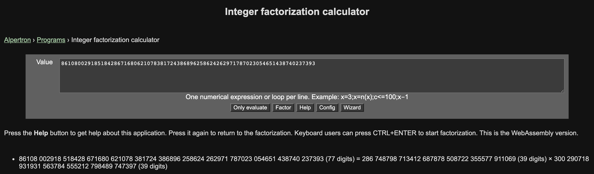

## BreakMe - 500
Description
`I encrypted important information and lost my private key! Can you help me to recover the content of the file?`

Moreover, we have two files
* `encrypted.txt` the encrypted text we have to decrypt
* `public.pem` the public key
```
-----BEGIN PUBLIC KEY-----
MDwwDQYJKoZIhvcNAQEBBQADKwAwKAIhAL5fZwx838wL00ES071xIp/T5EblMb81
FgNsElgzb2xRAgMBAAE=
-----END PUBLIC KEY-----
```

#### Solution
The goal is to decrypt the encrypted text, that probably contains the flag. The first thing I notice is that the public key is very short, and this could be the vulnerability to exploit. As a first attempt, I suppose that the message was encrypted with the RSA algorithm. As we know the encryption in RSA requires the public key which means `modulus N` and a public exponent `e`. Let’s extract `public.pem` file to find modulus *N* and *e*.

```shell
$ openssl rsa -noout -text -inform PEM -in public.pem -pubin
RSA Public-Key: (256 bit)
Modulus:
    00:be:5f:67:0c:7c:df:cc:0b:d3:41:12:d3:bd:71:
    22:9f:d3:e4:46:e5:31:bf:35:16:03:6c:12:58:33:
    6f:6c:51
Exponent: 65537 (0x10001)

$ python3 -c 'print(int("00be5f670c7cdfcc0bd34112d3bd71229fd3e446e531bf3516036c1258336f6c51", 16))'
86108002918518428671680621078381724386896258624262971787023054651438740237393
```
This result tell us that:
* `N = 86108002918518428671680621078381724386896258624262971787023054651438740237393`
* `e = 65537`

Now the decryption in RSA requires the private key which means modulus *N* and private exponent `d`. We have *N* as shown above, and we have to calculate *d*, ie compute the inverse modular of *e* and Euler’s totient function `phi`. 

**phi** is unknown because we need the prime numbers **p** and **q**. Also these prime numbers are unknown and to compute them we have to factorize N, which usually is very hard. But in this case we have a public key of 256 bit (too short) and the modulus *N* is probably factorizable. 

I try to factorize *N* with this site: www.alpertron.com.ar. It took about 3 minutes to compute the result:

* `p = 286748798713412687878508722355577911069`
* `q = 300290718931931563784555212798489747397`

Now we have all we need to compute the decryption.

```python
import gmpy
from Crypto.Util.number import *

N = 86108002918518428671680621078381724386896258624262971787023054651438740237393
e = 65537
p = 286748798713412687878508722355577911069
q = 300290718931931563784555212798489747397
phi = (p - 1) * (q - 1)
d = gmpy.invert(e, phi)

c = open("encrypted.txt", "rb").read()
c = c.hex()
c = int(c, 16)

decrypted = pow(c, d, N)

print("[+] N = "+str(N))
print("[+] e = "+str(e))
print("[+] p = "+str(p))
print("[+] q = "+str(q))
print("[+] phi = "+str(phi))
print("[+] d = "+str(d))
print()
print("[+] Decrypted ciphertext and Found the message m " + str(decrypted))
print("[+] FLAG is ", end=' ')
print(long_to_bytes(decrypted))
```

This simple script gives us the flag:

```shell
$ python3 rsa_attack.py 
[+] N = 86108002918518428671680621078381724386896258624262971787023054651438740237393
[+] e = 65537
[+] p = 286748798713412687878508722355577911069
[+] q = 300290718931931563784555212798489747397
[+] phi = 86108002918518428671680621078381724386309219106617627535359990716284672578928
[+] d = 52563235496868154743721179285926106867856121268586368115409795819089744895137

[+] Decrypted ciphertext and Found the message m: 3998731487633352107852441255033768239881091376738602013454220231226719498
[+] FLAG is:  b'\x02Ca1\xbc\xe8\xad\x165\xe4\xfc\x00AFFCTF{PermRecord}\n'
```

* **Flag**: `AFFCTF{PermRecord}`