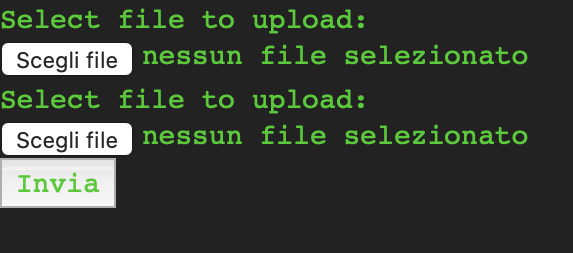
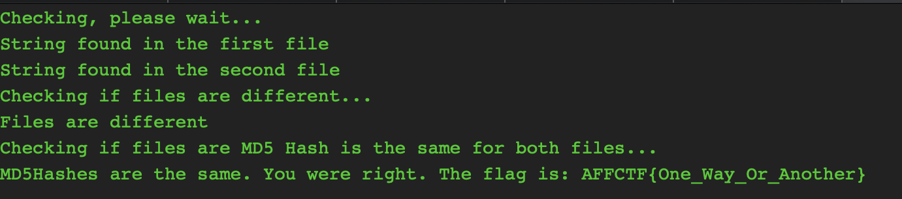

## Collisions Course - 500
Description
```text
Hello there,

I heard you are spreading rumors that hashing has some drawbacks. 
I don't believe it and I prove it! Go to http://web6.affinityctf.com/ and create 2 DIFFERENT files with the same md5 hash. 
Additionally, the files have to contain the phrase: "AFFCTF". 
File size limit is is 100000b.

Regards, Mr. Your-colleague-who-is-always-right
```

#### Solution
The goal is to generate two files with the same MD5 hash, which means study the collisions problem in md5.

After some time searching techniques for md5 collisions over the web, I found this [blog post](https://natmchugh.blogspot.com/2014/10/how-i-made-two-php-files-with-same-md5.html?m=1), which gave me the right way to solve the challenge.

It is very easy to create collisions in MD5 following the attack published by Wang in CRYPTO2004: [How to Break MD5 and Other Hash Functions](https://www.researchgate.net/publication/225230142_How_to_Break_MD5_and_Other_Hash_Functions). 

1) First of all I created a file of exactly 64 bytes, that contains the string "AFFCTF". This because MD5, as other hash algorithms, operates on one block of data at a time (64 bytes in MD5s case), and then uses this value as the starting point for the next block.

    ```python
    dummy = "AFFCTFAAAAAAAAAAAAAAAAAAAAAAAAAAAAAAAAAAAAAAAAAAAAAAAA"
    ```

2) Then I have to generate the md5 hash for this file. The problem is that generating the md5 hash with the basic command: `$ md5 input-file` the solution presented in the blog post doesn't work. This because the command adds some padding or extra information to the input file. For this reason, I used the script suggested in the blog post, that hash the file without additional padding or something like that. The script is available here: [MD5_no_padding.php](https://gist.github.com/natmchugh/fbea8efeced195a2acf2).
    * The result is: `ddda849c4796e007feff1a5f55ee183f`
<br>

3) Now we can use this hash as the initial value to find an MD5 collision. The fastest collision script suggested by the blog post is Marc Stevens *fastcoll* (see https://marc-stevens.nl/research/). I have downloaded the script here: https://github.com/brimstone/fastcoll. Inside that, there is also a Dockerfile that allows us to run the script in every OS. 
    ```shell
    $ docker run --rm -it -v $PWD:/work -w /work -u $UID:$GID brimstone/fastcoll -i ddda849c4796e007feff1a5f55ee183f -o msg1 msg2

    MD5 collision generator v1.5
    by Marc Stevens (http://www.win.tue.nl/hashclash/)

    Using output filenames: 'msg1' and 'msg2'
    Using initial value: ddda849c4796e007feff1a5f55ee183f

    Generating first block: ..............
    Generating second block: S10...............................................................
    Running time: 4.91723 s
    ```

4) Now we have to concatenate the two message generated by the script with our file and the simpler way is to use cat command: `cat msg1 >> input-file`.

5) We can check if the files have the same md5 hash:
    ```shell
    $ md5 a.py b.py

    MD5 (a.py) = dfe4111466b2d137b23c75a372d05ebd
    MD5 (b.py) = dfe4111466b2d137b23c75a372d05ebd
    ```

Ok they are equal, we are ready use the link in the description of the challenges. It open a web page where we can upload two files.


Uploading the two files generated the site gave us the flag.


* **Flag**: `AFFCTF{One_way_Or_Another}`
